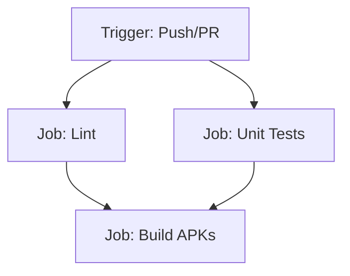

# GitHub Actions CI Configuration Design

This document details the design for setting up CI checks for the Android project using GitHub Actions.

## Triggers

The checks will be triggered on:
- Every `push` to the `master` branch.
- Every `pull_request` targeting the `master` branch.

## CI Workflow Pipeline

The workflow will run on an `ubuntu-latest` runner and use:
1. **JDK 17** (Temurin distribution) - matching the JVM toolchain version specified in the project's Gradle configuration.
2. **setup-gradle action** (`gradle/actions/setup-gradle@v4`) - automatically manages caching of dependency artifacts, wrapper files, and build caches to speed up runs.

The workflow consists of three jobs:

### 1. Job: `lint`
Runs static analysis to check code quality and correctness.
- **Command:** `./gradlew lintDebug`
- **Failure Handling:** Uploads the HTML report (`app/build/reports/lint-results-debug.html`) as a workflow artifact under the name `lint-results-debug` so it can be inspected in the browser.

### 2. Job: `test`
Runs the JUnit unit tests in the project (`src/test/`).
- **Command:** `./gradlew testDebugUnitTest`
- **Failure Handling:** Uploads the JUnit HTML reports (`app/build/reports/tests/testDebugUnitTest/`) as a workflow artifact under the name `test-reports` so failing tests can be diagnosed.

### 3. Job: `build`
Depends on both `lint` and `test` jobs completing successfully. Builds the debug and release binaries.
- **Command:** `./gradlew assembleDebug assembleRelease -x connectedAndroidTest --no-daemon`
- **Outputs:** Uploads the resulting APKs as artifacts:
  - Debug APK: `app/build/outputs/apk/debug/app-debug.apk`
  - Release APK: `app/build/outputs/apk/release/app-release.apk`
